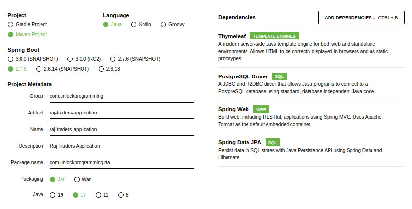

This articles explain how to start spring boot application using Spring Initializer.

<!--more-->

## Create Project

To create spring based project we need go to [http://start.spring.io](http://start.spring.io), select the Spring Boot
version and the different
dependencies you think you need, and download the project.

As an example screenshot shown below for Project.



You can open downloaded project on your favorite IDE such as Intellij, VSCode, Eclipse, etc.

## PostgreSQL Database

User docker command to start postgres database.

```bash
docker run -it --rm --name rta-postgres -p 5455:5432 -e POSTGRES_PASSWORD=rtapostgrespw -d postgres
```

## Connect with PostgreSQL

You need to add the configuration in your `application.properties` with the following settings.

```properties
#--------------------- DB Connection Properties ------------------
spring.datasource.url=jdbc:postgresql://localhost:5455/postgres
spring.datasource.username=postgres
spring.datasource.password=rtapostgrespw

#--------------------JPA-HIBERNATE-ORM Properties-----------------
spring.jpa.show-sql=true
spring.jpa.hibernate.ddl-auto=update
spring.jpa.properties.hibernate.dialect=org.hibernate.dialect.PostgreSQLDialect
spring.jpa.properties.hibernate.format_sql=true
```

## Create Index Controller


```java
@Controller
public class IndexController {

    @GetMapping("/")
    public String index(@RequestParam(name = "name", required = false, defaultValue = "World") String name, Model model) {
        model.addAttribute("yourName", name);
        return "index";
    }

}
```

## Run Application

## Verify Application